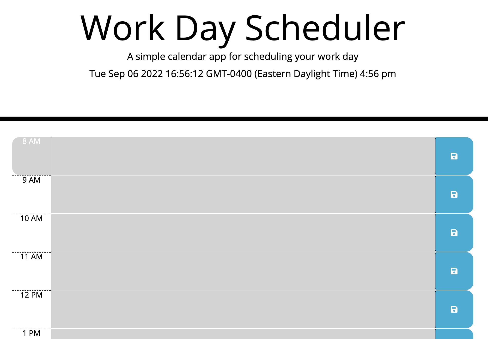
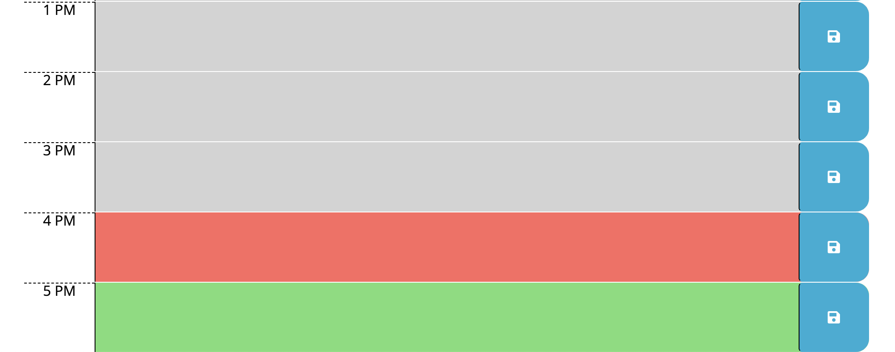
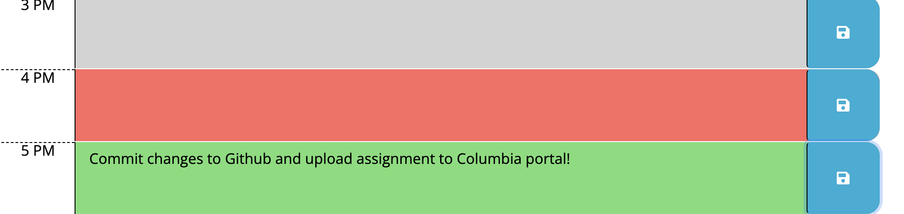

# Work Day Scheduler
This assignment had us create a daily planner to create a schedule using time blocks for standard business hours. When opening the planner, the current day/time is displayed at the top of the page and when presented with the time-blocks, they are color-coded to indicate whether they are in the past, present, or future. Saving to local storage in Javascript helps us enter an event and save that event for each time block.

# Links to Assignment
Find the deployment links below:

Github Repo: https://github.com/bettinastaartjes/Work-Da-Scheduler.git
  
Deployed Link: https://bettinastaartjes.github.io/Work-Day-Scheduler/

# Assignment Summary
Unfortunately I had some issues cloning the starter code repo to my computer, so none of the commits I made to this assignment got saved. The first step I took in completing this assignment was creating the time blocks, using columns (bootstrap), and figuring out how to display the current day/time in the javscript portion. 

Timeblocks/Current Time

You'll notice the past, present, and future timeblocks are color coded.

Lastly, you can enter tasks and save to local storage (refresh the page and tasks will remain there).

